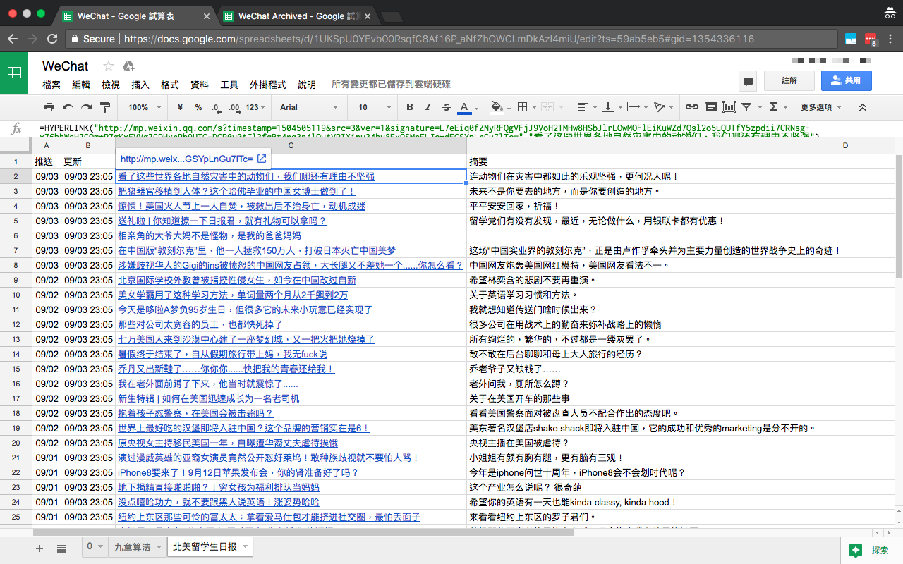

微信公众号文章资源整合至个人 Google Spreadsheet 以便快速浏览
============
 个人第一个 Python 项目。有任何建议/issues/pull requests 欢迎提出

 Simple script that collects recent WeChat official account articles, saves them to SQLite database,
 and insert them into a single spreadsheet for convenient browsing. Older articles will be archived
 to another spreadsheet and removed from the main one.
 
 
 ## Dependencies
 - Python 3+
 - [WechatSogou](https://github.com/Chyroc/WechatSogou) to fetch WeChat official
    account information, as well as its recent articles
 - SQLite to store GZH(公众号) info and its articles
 - [peewee](https://github.com/coleifer/peewee) as a simple ORM for SQL queries
 - [pygsheets](https://github.com/nithinmurali/pygsheets) as a Python wrapper for 
   [Google Spreadsheets API v4](https://developers.google.com/sheets/api/)
 
## Descriptions
 This project uses [WechatSogou](https://github.com/Chyroc/WechatSogou). 
 
 Because of the anti-crawling measures on the WeChat sogou platform, all article urls gets generated
 with the current timestamp and will be expired after about 5 hours. Therefore, when the script is 
 run the second time, several things happen:
 1. If there are new articles published by accounts, save those to the database and insert them in 
    the leading rows of its corresponding worksheet
 2. For older articles not appearing in recent articles of the official accounts, they will be 
    removed from the main spreadsheet and archived into the other spreadsheet as history articles.
 3. For the rest articles, we will update their links in the spreadsheet every time the script gets
    run, in order for the url of the article to remain valid.
    
 You may set up a cron job to run the script right before the urls get invalidated.
 
 
## Usage
 1. Install dependencies `$ pip3 install wechatsogou peewee pygsheets`
 2. Set up [Google Spreadsheet API Authentication](http://gspread.readthedocs.io/en/latest/oauth2.html)
    - You will get a JSON file in this step. Rename it to `credentials.json` and put it 
      in the same folder.
    - Using the same Google account, create two new spreadsheets named `WeChat` and `WeChat Archived`,
    - Add the email in `credentials.json` (the value of `client_email`) as a collaborator in two
      spreadsheets
 3. Add WeChat IDs (微信号) of WeChat official accounts you would like to follow in `gzh_wechat_ids[]` 
    at the beginning of `main.py`. WeChat IDs can be searched and achieved [here](http://weixin.sogou.com/)
    or on your WeChat app.
 
## Note
  - Sending frequent requests to the WeChat Sogou platform may trigger the CAPTCHA.
    The [WechatSogou](https://github.com/Chyroc/WechatSogou) API will open up the CAPTCHA image
    and ask you to enter the code in the console. 
  - The Google Spreadsheet API also has 
    [Limits and Quotas on API Requests](https://developers.google.com/analytics/devguides/config/provisioning/v3/limits-quotas).
    Be aware of those if you run the script unattended.

## Screenshots

